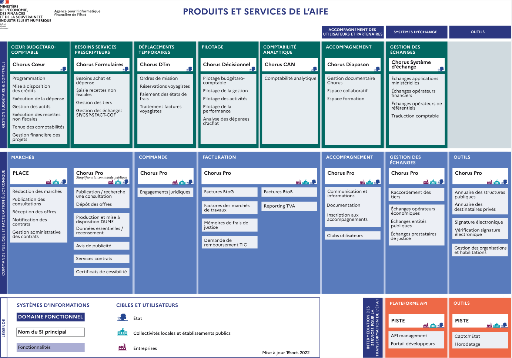

# Rapport d'activiter de la semaine

## À été discuté lors de la réunion de début de semaine :
* Présentation rapide du projet.
* Présentation rapide des attentes du projet.
* Présentation rapide du site sur lequel les données pourraient être récupérées.
* Discussion générale.

## Ce qui a été fait :
* On a créé un Git, lien : https://github.com/ZentsuGo/etude_clinique_anticor

* On a regardé le site Place.
    Observations pour l'instant :
    - Le site est déroutant, les informations sont très souvent mal voire mal renseignées.
    - Le système de requête sur le site est catastrophique, impossible de trouver correctement ce que l'on cherche.
    - Le backend du site semble être géré par Dume.

* On a regardé Dume.
    Observations pour l'instant :
    - Le système de requête du site semble plutôt bon, et il ne devrait pas être excessivement compliqué de tout scraper.
    - Les données sont dans un format JSON clair et facilement utilisable.
    - Les données sont presque toutes bien renseignées, à en juger par l'état actuel de nos observations. Nous avons constaté que sur 200 données récupérées, 100 sont anciennes et 100 sont récentes, avec un taux de renseignement "correct" de 95% et 100% respectivement.
    - Toutes les informations semblent être là, mais il serait préférable d'obtenir l'avis des juristes.
    - Lien : https://dume.chorus-pro.gouv.fr/#/accueil/donnees-essentielles/rechercher


## Information complementaire

structure des json donner par Dume :
```md

- **`response`** : Objet contenant :
  - **`messageList`** : Liste d'objets, chaque objet ayant les clés :
    - `type` : string
    - `code` : string
    - `message` : string
  - **`donneesEssentielles`** : Liste d'objets, chaque objet ayant les clés :
    - **`domainListDonneesEssentiellesMP`** : Objet contenant :
      - `domainRecuperDEExecution` : NoneType
      - **`domainRecuperDEDeBase`** : Objet contenant :
        - **`acheteur`** : Objet contenant :
          - `id` : string
          - `nom` : string
        - `typeDE` : string
        - `id` : string
        - `autoriteConcedante` : NoneType
        - `nature` : string
        - `objet` : string
        - `codeCPV` : integer
        - `procedure` : string
        - **`lieuExecution`** : Objet contenant :
          - `typeCode` : string
          - `code` : string
          - `nom` : string
        - `dureeMois` : integer
        - `dateSignature` : NoneType
        - `datePublicationDonnees` : string
        - `dateNotification` : NoneType
        - `dateDebutExecution` : NoneType
        - `montant` : float
        - `valeurGlobale` : float
        - `montantSubventions` : NoneType
        - `formePrix` : string
        - **`titulaires`** : Objet contenant :
          - `id` : string
          - `denominationSociale` : string
          - `typeIdentifiant` : string
        - `concessionnaires` : NoneType
      - **`donneesConsultation`** : Objet contenant :
        - `numeroLot` : string
        - `idConsultation` : string
        - `refFonctionnelleConsultation` : NoneType
        - `refFonctionnelleDE` : string
        - `serviceDumePublicationDate` : string
        - `datagouvPubliable` : boolean
        - `accessible` : boolean
        - `idDemandeur` : string
        - `rsDemandeur` : string
      - **`donneesDeBase`** : Objet similaire à `domainRecuperDEDeBase` 
```


Schema des Produits et services de l'AIFE :



Petit script vite fais pour donner le pourcentage de chaque attribution qui ont tel valeur pour tel champs:
```bash
#!/bin/bash

if [ "$#" -ne 2 ]; then
    echo "Usage: $0 <field_name> <field_value>"
    exit 1
fi

field_name=$1
field_value=$2

# Calculate percentage
percentage=$(jq --argjson field_value "$field_value" --arg field_name "$field_name" \
  '.response.donneesEssentielles[] | select(.domainListDonneesEssentiellesMP.domainRecuperDEDeBase[$field_name] == $field_value) | .domainListDonneesEssentiellesMP.donneesDeBase.id' data.json | \
  wc -l | awk '{ printf "%.2f\n", ($1 / total) * 100 }' total=$(jq '.response.donneesEssentielles | length' data.json))

# Print the percentage
printf "Percentage of entries with '$field_name' equal to '$field_value': %.2f%%\n" "$percentage"

# List IDs with the specified condition
echo "IDs with '$field_name' equal to '$field_value':"
jq --argjson field_value "$field_value" --arg field_name "$field_name" \
  '.response.donneesEssentielles[] | select(.domainListDonneesEssentiellesMP.domainRecuperDEDeBase[$field_name] == $field_value) | .domainListDonneesEssentiellesMP.donneesDeBase.id' data.json
```

Exemple utilisation : ``` ./script.sh montant null ```